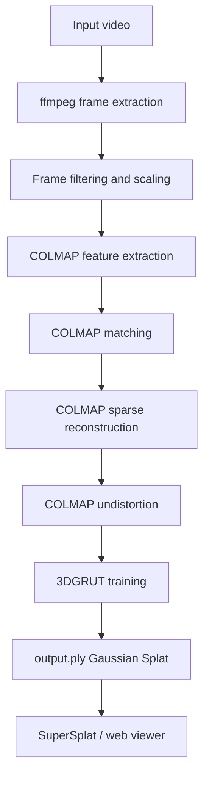

# quicksplat

One-command video-to-3D-Gaussian-Splat pipeline for local NVIDIA GPU workflows.

Turn a handheld video into an INRIA-format `.ply` Gaussian Splat using ffmpeg, COLMAP, and NVIDIA 3DGRUT. The project is designed for reproducible local reconstruction: setup scripts, platform notes, real example assets, configs, and troubleshooting docs are included.


## Why This Project Matters

3D Gaussian Splatting is powerful, but the practical barrier is the pipeline: frame extraction, camera pose estimation, CUDA environment setup, training configuration, and output inspection. `quicksplat` packages that path into a scriptable workflow so reconstruction becomes repeatable instead of a fragile notebook or one-off terminal session.

This is the strongest portfolio project because it has:

- a clear technical outcome
- a hard dependency chain
- real GPU and reconstruction constraints
- useful docs for nontrivial failures
- a demo-friendly output artifact
- existing external interest through stars/forks

## Features

| Capability | Description |
|---|---|
| Video ingestion | Extracts frames with ffmpeg, handles rotation, and scales large inputs. |
| Camera reconstruction | Runs COLMAP feature extraction, matching, mapping, and undistortion. |
| Training | Launches NVIDIA 3DGRUT for Gaussian Splat training. |
| Fast preview | Supports short preview runs before full training. |
| Resume path | Reuses COLMAP output after crashes or interrupted sessions. |
| Cross-platform notes | Linux, WSL2, and macOS cloud-GPU guidance. |
| Documentation | Video capture guide, output guide, troubleshooting guide, configs, and examples. |

## System Architecture



## Tech Stack

| Layer | Tools |
|---|---|
| Pipeline | Bash, PowerShell |
| Video processing | ffmpeg |
| Structure-from-motion | COLMAP 4.x |
| Training | NVIDIA 3DGRUT, PyTorch, CUDA |
| Environment | Miniforge, conda/mamba |
| Output inspection | SuperSplat / compatible splat viewers |

## Prerequisites

| Requirement | Minimum | Check |
|---|---:|---|
| OS | Linux / WSL2 | `uname -a` |
| GPU | NVIDIA | `nvidia-smi` |
| CUDA driver | 11.8+ | `nvidia-smi` |
| VRAM | 8 GB+ | `nvidia-smi` memory usage |
| RAM | 16 GB, 32 GB recommended | `free -h` |
| Disk | 20 GB free | `df -h ~` |
| Git | any recent version | `git --version` |

If `nvidia-smi` fails, fix the GPU driver first. COLMAP and 3DGRUT will not be the real problem yet.

## Installation

```bash
git clone https://github.com/abhinow03/quicksplat.git ~/quicksplat
bash ~/quicksplat/install/setup_linux.sh
```

The setup installs Miniforge, a `tools` environment for COLMAP/ffmpeg, and a `3dgrut` environment for training under:

```text
~/3dgrut_setup/
├── miniconda3/
│   └── envs/
│       ├── tools/
│       └── 3dgrut/
└── repos/
    └── 3dgrut/
```

## Usage

```bash
mkdir ~/my_scene
cd ~/my_scene
cp /path/to/myvideo.mp4 .
bash ~/quicksplat/splat.sh myvideo.mp4
```

Preview run:

```bash
bash ~/quicksplat/splat.sh myvideo.mp4 --preview
```

Resume after COLMAP already completed:

```bash
bash ~/quicksplat/splat.sh myvideo.mp4 --skip-colmap
```

Options:

```text
bash splat.sh <video.mp4> [OPTIONS]

  --iters N         Training iterations, default 30000
  --preview         Quick 7000-iteration run for quality check
  --fps N           Override automatic frame extraction fps
  --model NAME      colmap_3dgut, colmap_3dgrt, colmap_3dgut_mcmc, colmap_3dgrt_mcmc
  --skip-colmap     Reuse existing workspace/colmap/
  --output-dir PATH Save output.ply somewhere else
  --help            Print usage
```

## Output

```text
my_scene/
├── output.ply
├── pipeline.log
└── workspace/
    ├── frames/
    ├── colmap/
    └── runs/
```

Open `output.ply` in [SuperSplat](https://supersplat.playcanvas.com/) or a compatible Gaussian Splat viewer.

## Demo

Current example:

- `examples/f1_toycar/`
- Result: 539,762 Gaussians, 128 MB, 26.67 dB PSNR

Add:

```text
docs/demo/input-video-preview.gif
docs/demo/colmap-sparse-reconstruction.png
docs/demo/supersplat-output.gif
```

Suggested terminal demo:

```bash
time bash ~/quicksplat/splat.sh examples/f1_toycar/input.mp4 --preview
tail -f pipeline.log
```

## Folder Structure

```text
quicksplat/
├── splat.sh
├── splat.ps1
├── configs/
│   ├── colmap_config.ini
│   └── train_config.yaml
├── docs/
│   ├── output_guide.md
│   ├── troubleshooting.md
│   └── video_guide.md
├── examples/
│   └── f1_toycar/
├── install/
│   ├── setup_linux.sh
│   ├── setup_macos.md
│   ├── setup_windows.md
│   └── select_frames.py
└── README.md
```

## Troubleshooting

| Symptom | Likely Cause | Fix |
|---|---|---|
| `nvidia-smi` fails | Driver/CUDA not visible | Fix host driver or WSL2 GPU passthrough before running setup. |
| COLMAP starts but crashes | Missing or mismatched CUDA-linked dependency | Verify the `tools` conda env and `libfaiss` install. |
| COLMAP registers too few images | Bad video motion, blur, low texture, reflective object | Reshoot with slow outside-in loops and more overlap. |
| Training appears frozen | First-run CUDA JIT compilation | Wait several minutes before interrupting. |
| Output is noisy | Too few frames or poor camera path | Increase capture quality, use three height loops, avoid motion blur. |

See [docs/troubleshooting.md](docs/troubleshooting.md) for detailed fixes.

## Engineering Notes

- COLMAP 4.x changed flag names from `SiftExtraction`/`SiftMatching` to `FeatureExtraction`/`FeatureMatching`.
- Phone videos often need rotation correction before feature extraction.
- Preview mode is essential because full training can hide input-quality problems until late.
- Local-only processing avoids uploading source video or reconstruction assets.

## Roadmap

- Add GitHub Actions shell linting for `splat.sh`.
- Add an `--inspect` command that validates input video before running COLMAP.
- Add automatic quality report: registered frames, sparse point count, training PSNR, output size.
- Add Docker or devcontainer path for Linux users with matching NVIDIA runtime.
- Add direct viewer integration with the AR/VR neural reconstruction repo.

## License

MIT. See [LICENSE](LICENSE).
