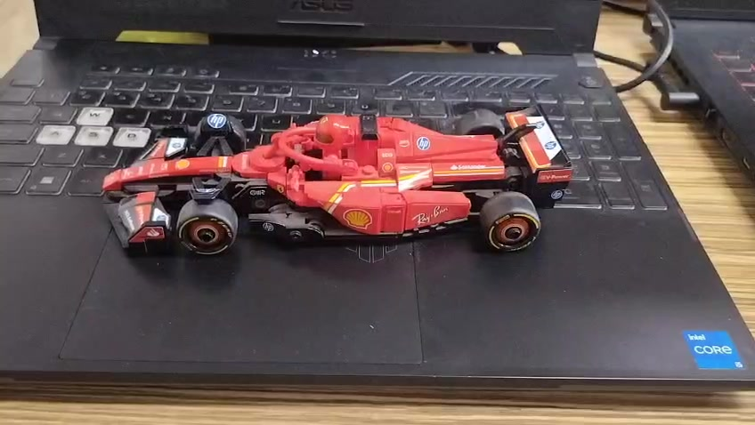
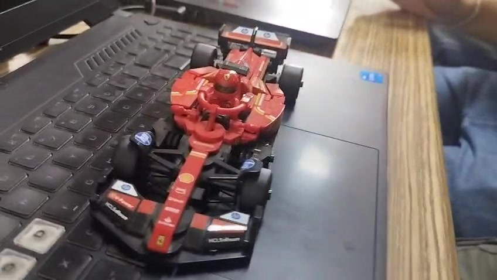
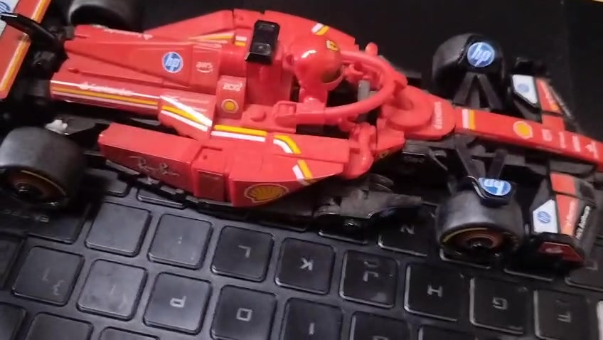
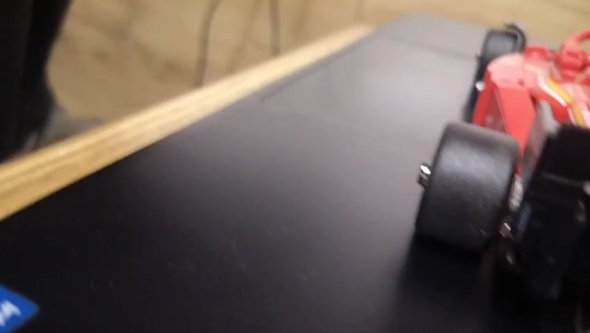
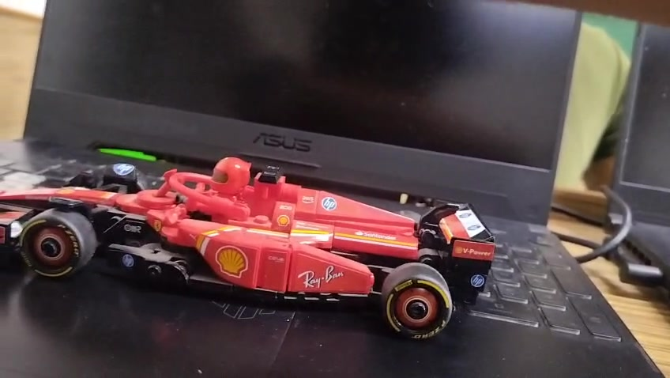

# Example — F1 Toy Car

> **Bad input. Impressive output.** This is the whole point of quicksplat.

## The video

- ~40 seconds, handheld phone walk-around
- Shaky. Bad lighting. No tripod. Shot indoors.
- Resolution: 848×478 @ 30fps
- No special setup — just picked up a toy car and walked around it

## Pipeline stats

| Step | Result |
|------|--------|
| Frames extracted | 157 (at 4fps) |
| COLMAP registered | 135/157 frames (86%) |
| 3D points | 18,058 |
| Reprojection error | 0.748px |
| Training | 30,000 iterations, ~22 min on RTX 4090 |
| Output Gaussians | 539,762 |
| Output file size | 128MB |
| PSNR | 26.67 dB |

## Input frames

A sample of what the input video looked like — 5 frames spread across the full capture:

| Frame 1 | Frame 40 | Frame 80 | Frame 120 | Frame 157 |
|---------|---------|---------|---------|---------|
|  |  |  |  |  |

## Output

The output `.ply` is attached to the [GitHub Release](../../releases/latest) — download it and drag it into [SuperSplat](https://supersplat.playcanvas.com) to view.

539,762 Gaussians from a 40-second phone video. Not bad.

## Command used

```bash
bash splat.sh f1.mp4 --iters 30000
```

That's it. No manual tuning, no parameter tweaking. Default settings.

## Contribute your own

Open a PR adding a folder to `examples/` with:
- A `README.md` like this one
- 3–5 input frames
- Your hardware, video length, and pipeline stats
- A link to download the `.ply` (attach to your PR or host externally)
